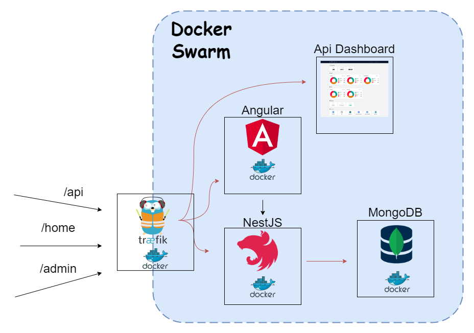
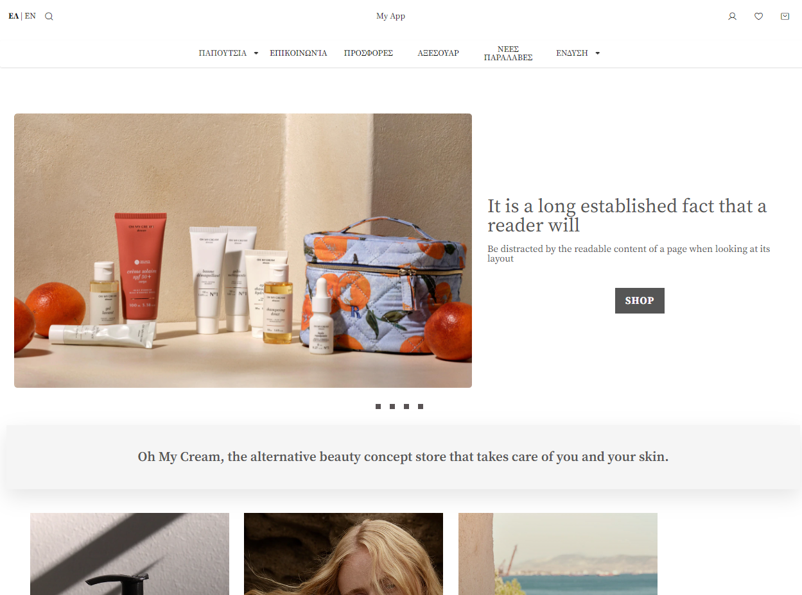
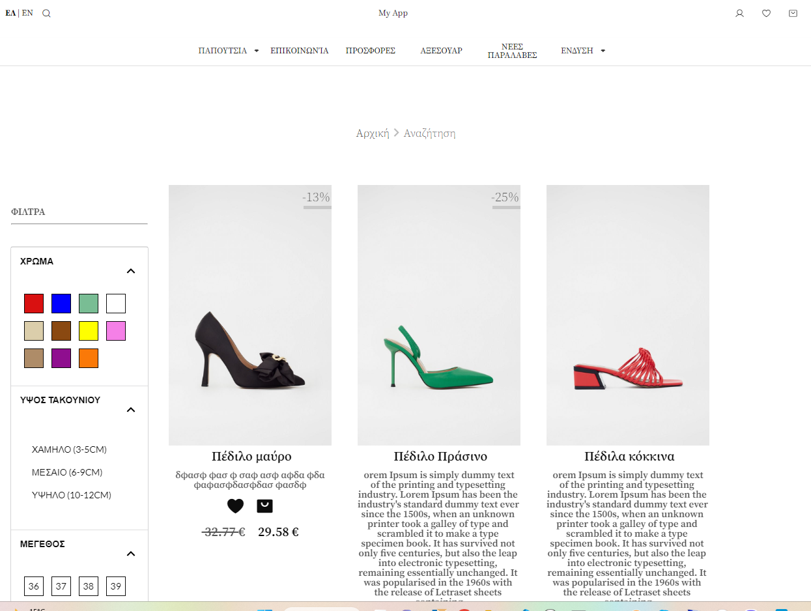
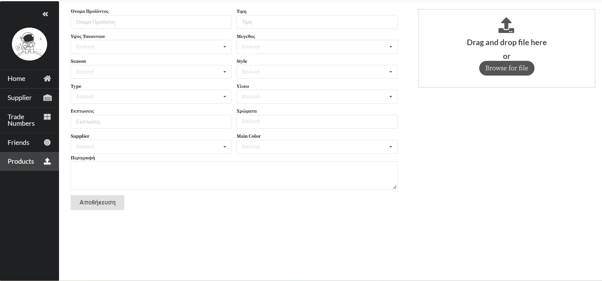

# MEAN STACK (NestJs) E-shop

# Architecture

The Stack is implemented with **_Docker Swarm Microservcices_**, with traefik at the role of ingress, sending **incoming requests** to the **Frontend (Angular)**, which subsequently make request to the **Backend (NestJS )**, which on its turn makes **queries to MongoDB** to sustain state. The above is described as shown in **Fig. 1.**

|  |
| :---------------------------------------------------------------------: |
|         <b>Fig.1 - Docker Swarm With Traefik Implementation</b>         |

# Contents

There are two working environments:

1. The **Client** home page [https:eshop.tsilingeridis.eu/home](https:eshop.tsilingeridis.eu/home)
2. The **Admin** home page [https:eshop.tsilingeridis.eu/admin](https:eshop.tsilingeridis.eu/admin)

### 1. The Client Environment

The client environment contains the following pages:

a. **Home page**, as shown in **Fig.2**, where any messages are displayed in a carousel/slide, pages are listed in grid, and sales are presented in a dragging carousel [https:eshop.tsilingeridis.eu/home](https:eshop.tsilingeridis.eu/home),
b. **Search page**, as shown in **Fig.3**, for searching products with a filtering side-bar, where user can check out the products, filter in regard the price, color, size, etc. [https://eshop.tsilingeridis.eu/home/account/whishlist](https://eshop.tsilingeridis.eu/home/account/whishlist),
c. **Whishlist page** for maintaining user's whishlist [https:eshop.tsilingeridis.eu/home/search](https:eshop.tsilingeridis.eu/home/search),
d. **Cart page** to overview the orders and changing the quantity, and color [https://eshop.tsilingeridis.eu/home/cart](https://eshop.tsilingeridis.eu/home/cart) and
e. **Payment page** which includes the shipping information and payment information. [https://eshop.tsilingeridis.eu/home/cart/checkout/shipping](https://eshop.tsilingeridis.eu/home/cart/checkout/shipping)

Payment has been configured with Paypal (account or credit card)

|  |
| :----------------------------------------------------------: |
|               <b>Fig.2 - Home/Landing Page</b>               |

|  |
| :------------------------------------------------------------: |
|               <b>Fig.3 - Search Product Page</b>               |

### 2. The Admin Environment

The admin environment contains the following pages:

a. **Home page** containing the landing page `not completed` [https:eshop.tsilingeridis.eu/admin/home](https:eshop.tsilingeridis.eu/admin/home),
b. **Supplier page** with a page tab for the presentation of suppliers, which have been previously recorded [https://eshop.tsilingeridis.eu/admin/suppliers/show-suppliers](https://eshop.tsilingeridis.eu/admin/suppliers/show-suppliers), and another page tab for adding new suppliers. [https://eshop.tsilingeridis.eu/admin/suppliers/add-supplier](https://eshop.tsilingeridis.eu/admin/suppliers/add-supplier),
c. **Trade numbers page** where the components of the trade number and their matching individual code is presented and may be configured/changed [https://eshop.tsilingeridis.eu/admin/trade-numbers](https://eshop.tsilingeridis.eu/admin/trade-numbers),
d. **Products page**, shown in **Fig. 4** allows adding new products and their photos with drag & drop, or file browsing [https://eshop.tsilingeridis.eu/admin/add-products](https://eshop.tsilingeridis.eu/admin/add-products).

|  |
| :-----------------------------------------------------------: |
|             <b>Fig.4 - Admin Add Product Page</b>             |
